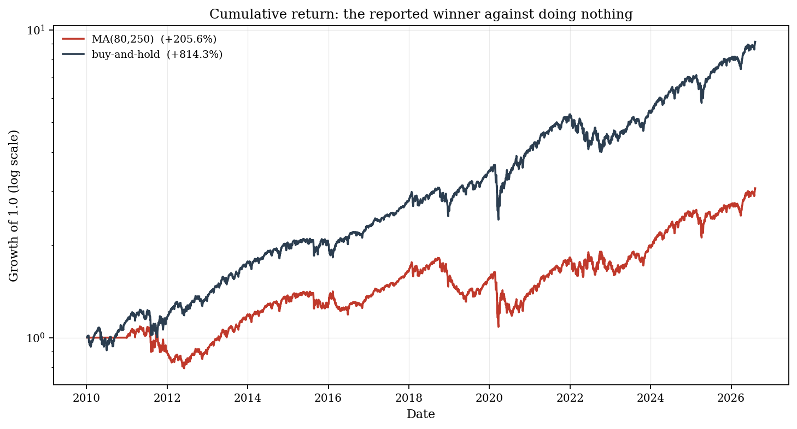
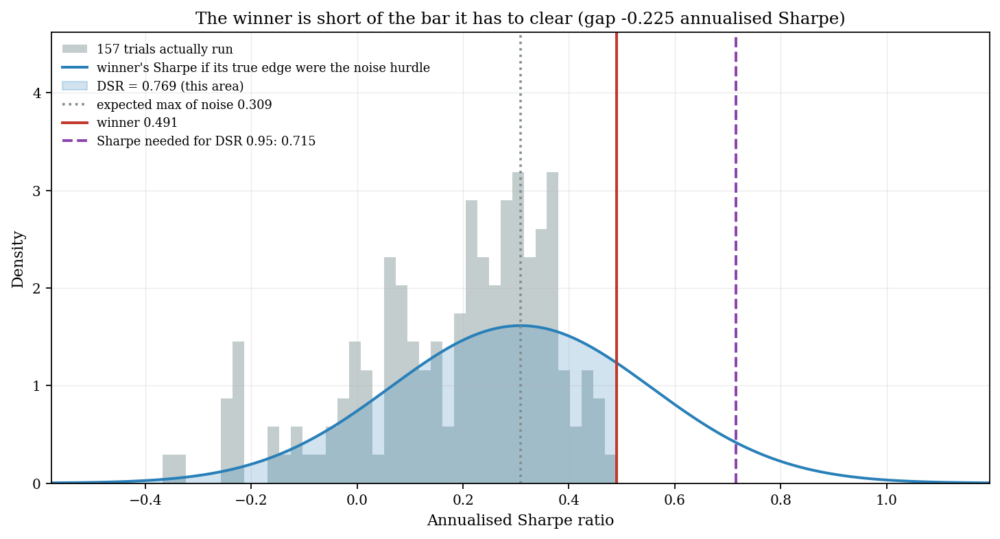

# The Backtest Luck-Detector

**How much of your backtest is luck?**

Mine 157 trading strategies over sixteen years of SPY. Keep the best one, exactly as any
backtester would. Then ask whether it's real.

```
$ luckdet demo

SPY, 2010-01-04 to 2026-08-07 · 4,174 closes · 157 strategies mined
Winner: MA(80,250) — annualised Sharpe 0.491, total return +205.6%

  [PASS]  Probabilistic Sharpe Ratio            0.9764   ← the naive test passes
  [FAIL]  Deflated Sharpe Ratio                 0.7692   needs ≥ 0.95
  [FAIL]  Probability of Backtest Overfitting   0.8396   needs ≤ 0.20
  [ — ]   Reality Check / SPA                   not one of the 157 beat buy-and-hold

VERDICT: LIKELY LUCK
```

**Why.** Once you've tried 157 variants, the winner needs a Sharpe of 0.715 before it
means anything. It managed **0.491** — and buy-and-hold, doing nothing at all, returned
**+814.3%** against its +205.6%, with a smaller drawdown.



<sub>**Figure 1.** The reported winner against doing nothing. Sixteen years of work to
finish 609 percentage points behind the thing you could have bought on day one.</sub>



<sub>**Figure 2.** The winner clears the expected maximum of noise (0.309) — so do 43 of
the 157 variants — but that isn't the bar the test applies. Allow for the 0.247 standard
error on its own Sharpe and 95% confidence needs 0.715. The shaded area *is* the Deflated
Sharpe Ratio, 0.7692.</sub>

It isn't a machine that says no. If you plant a real edge in 5 of 50 variants, the same
machinery comes back with **LIKELY SKILL** and no flags at all. That control is the second
half of `luckdet demo`, and it's in the test suite, because a luck detector that never
finds skill is just a rubber stamp.

```bash
pip install -e ".[dev,data]"
luckdet demo                      # the whole argument, end to end
```

Point it at your own symbol with `luckdet report AAPL --output aapl.html`, or read the
[quickstart notebook](examples/01_quickstart.ipynb), which walks through the SPY result
cell by cell.

---

## What it measures

Three different problems get lumped together as "overfitting". They aren't the same
thing, and this pulls them apart:

| Failure mode | The question | Test |
|---|---|---|
| **Small-sample noise** | Is the record long enough to tell this Sharpe from zero, given fat tails? | Probabilistic Sharpe Ratio, Minimum Track Record Length |
| **Selection bias** | Would the best of N random strategies have looked this good anyway? | Deflated Sharpe Ratio, White's Reality Check, Hansen's SPA |
| **Overfitting** | Does the parameter set that won in-sample survive out-of-sample? | Probability of Backtest Overfitting via CSCV |

> A backtest is a *maximum*, not a sample mean. Nobody publishes the first strategy they
> tried; they publish the best of the several hundred they tried. The reported Sharpe
> ratio is an order statistic, and the ordinary t-test is invalid on it.

## The SPY result in full

Two findings, and the second is the one that matters.

**The winner fails deflation.** A Sharpe of 0.491 with a 97.6% probabilistic Sharpe ratio
looks significant. But 157 variants cluster into about 12 independent bets, the best of
pure noise would be expected to score 0.309 anyway, and the honest probability the edge is
real comes to 76.9% — under the 95% bar.

**Not one of the 157 beat buy-and-hold.** Zero. Buy-and-hold returned 814.3% at a Sharpe
of 0.867 with a *smaller* drawdown (-33.7% against the winner's -40.3%). Subtract it from
the winner and what's left has an annualised Sharpe of **-0.416**. The whole exercise
destroyed value, and 26 of the variants (17%) posted a negative Sharpe outright.

Four tests agree, and they disagree about *how* damning it is:

| Test | Result | Reading |
|---|---|---|
| Probabilistic Sharpe Ratio | 0.9764 | the record is long enough — and that's all it says |
| Deflated Sharpe Ratio | 0.7692 | probably luck |
| PBO via CSCV, 12,870 splits | 0.8396 | selection is worse than picking at random |
| Reality Check / SPA vs buy-and-hold | p = 1.0000 | nothing in the family to test |
| Reality Check / SPA vs zero | p = 0.24 / 0.43 | not significant even against the soft benchmark |

The same 157 strategies score p = 0.24 against zero and p = 1.00 against buy-and-hold.
**The benchmark is the question**, and a write-up that reports only the first hasn't
stated a single false number.

Read the top row twice. **The naive test passes.** Anyone who ran a Probabilistic Sharpe
Ratio, saw 97.6% and stopped there would have called the record sound. Every test that
knows a search took place disagrees.

## What would change the conclusion

Three limitations, all measured rather than guessed at, and all repeated in the caveats of
every report the tool writes.

**The window flatters the benchmark.** 2010–2026 was a historic bull market, and trend
rules that go flat or short give up ground in a relentless uptrend. This is evidence about
*this* family of rules over *this* window, not a verdict on trend following. Run
`luckdet mine` on your own symbol and period — the tool has no stake in the answer.

**The PBO figure is optimistic, not pessimistic.** The cross-validation splits the record
into contiguous blocks with no gap between the in-sample and out-of-sample halves, so a
rule with a 250-day lookback is contaminated near each seam. That makes the winner look
*more* persistent than it is, which means the true probability of overfitting is likely
worse than the 0.84 reported.

**A luck verdict is weak evidence of absence.** [`METHODS.md`](docs/METHODS.md) §9
measures how cautious this thing is rather than leaving you to find out: a real, persistent
Sharpe of 2.0 in 10 of 50 variants over five years gets recognised as skill only about one
time in five. It's much better at catching luck than at certifying skill, and that
asymmetry is deliberate.

The rule table that turns four statistics into one label is a judgement too, not a
published result. [`METHODS.md`](docs/METHODS.md) §9 says which of the numbers are
conventional and which were invented here.

## Install

Needs **Python 3.10 or later**; tested through 3.14. macOS ships 3.9, which is end-of-life
— check with `python3 --version` and grab a current build from
[python.org](https://www.python.org/downloads/) if you need one.

```bash
git clone https://github.com/hisrealme/backtest-luck-detector.git
cd backtest-luck-detector
python3 -m venv .venv && source .venv/bin/activate
python3 -m pip install --upgrade pip     # editable installs need pip >= 21.3
make install                             # pip install -e ".[dev,data]"
make check                               # lint + typecheck + tests
```

## Usage

The [quickstart notebook](examples/01_quickstart.ipynb) is the full tour. The short version:

```bash
luckdet summary returns.csv --date-column date   # describe a track record
luckdet mine SPY --start 2010-01-01              # mine a grid, deflate the winner
luckdet report SPY --output spy.html             # all four tests, one HTML file
luckdet demo                                     # the whole argument, end to end
```

If you kept every variant you tried — and you should — hand over the whole family and let
the tool work out the trial count and their correlation itself:

```python
from luckdetector import load_trials_csv
from luckdetector.report import analyse

trials = load_trials_csv("every_variant_i_tried.csv", date_column="date")
verdict = analyse(trials).verdict

print(verdict.label)        # LIKELY_LUCK
print(verdict.narrative)    # ...and which test objected, and why
```

Three of the four tests are undefined without the losers, so a single track record only
gets you part of the way:

```python
import numpy as np
from luckdetector import ReturnSeries
from luckdetector.stats import (
    deflated_sharpe_ratio,
    min_track_record_length,
    probabilistic_sharpe_ratio,
)

returns = ReturnSeries(np.random.default_rng(0).normal(0.0005, 0.01, 1260))

probabilistic_sharpe_ratio(returns)             # is the record long enough?
min_track_record_length(returns) / 252          # ...if not, how long?
deflated_sharpe_ratio(returns, n_trials=200)    # would 200 coin flips beat it?
```

Or run the individual tests yourself and combine them by hand:

```python
from luckdetector import assess
from luckdetector.mining import mine
from luckdetector.stats import probability_of_backtest_overfitting, reality_check

result = mine(my_prices, cost_bps=1.0)                 # 157 variants

probability_of_backtest_overfitting(result.trials)     # 0.5 is the noise baseline
reality_check(result.trials, result.buy_and_hold)      # White's RC + Hansen's SPA

assess(psr=..., dsr=..., pbo=..., spa=...)             # every argument optional
```

`reality_check` defaults to a benchmark of zero, the soft test — "did any of these make
money". Pass `result.buy_and_hold` to ask whether the search was worth running at all. On
SPY those two answers are p = 0.24 and p = 1.00.

Every argument to `assess` is optional, and a missing test never counts as a passing one —
if a verdict rests on less evidence, it says so. The thresholds and the combination rules
are laid out, and argued with, in [`METHODS.md`](docs/METHODS.md) §9.

`luckdet demo` runs the machinery twice: on real prices, where it returns
**LIKELY_LUCK**, then on a family with a genuine edge planted in it, where it returns
**LIKELY_SKILL**. It writes one self-contained HTML report with both figures embedded as
base64 — no external CSS, no CDN, no JavaScript — so it opens fine on a machine with no
network.

Data resolution is **cache, then download, then refuse**. If nothing is cached and the
download isn't available the command *fails* and points you at `luckdet demo --offline`,
which runs on a synthetic path and stamps every figure and every number `SYNTHETIC`. It
won't quietly swap a random number generator in for a market.

## Design principles

1. **Every number is falsifiable.** Each statistic is checked against a known null or a
   published reference value — never against a re-transcription of its own formula.
2. **No network in tests, and no market data in the repository.** CI is deterministic and
   offline.
3. **Seeded everywhere.** Same seed, byte-identical report.
4. **Library first, CLI second.** No statistics live in user-facing code.
5. **Honest verdicts.** No black-box composite score — a transparent rule table where each
   test can raise a flag on its own, and the report names the one that fired.

## Documentation

- [`docs/METHODS.md`](docs/METHODS.md) — the mathematics, with citations, and a plainly
  marked list of every place a threshold is a judgement call rather than a convention.
- [`docs/BLUEPRINT.md`](docs/BLUEPRINT.md) — the design, the decisions that are settled,
  and the limitations that are measured.
- [`examples/01_quickstart.ipynb`](examples/01_quickstart.ipynb) — the SPY result end to
  end, shipped with its outputs so it reads without being run.

## References

Bailey & López de Prado (2012, 2014); Bailey, Borwein, López de Prado & Zhu (2017);
White (2000); Hansen (2005); Harvey & Liu (2015); Politis & Romano (1994).
Full citations in [`docs/BLUEPRINT.md`](docs/BLUEPRINT.md).

## License

MIT
